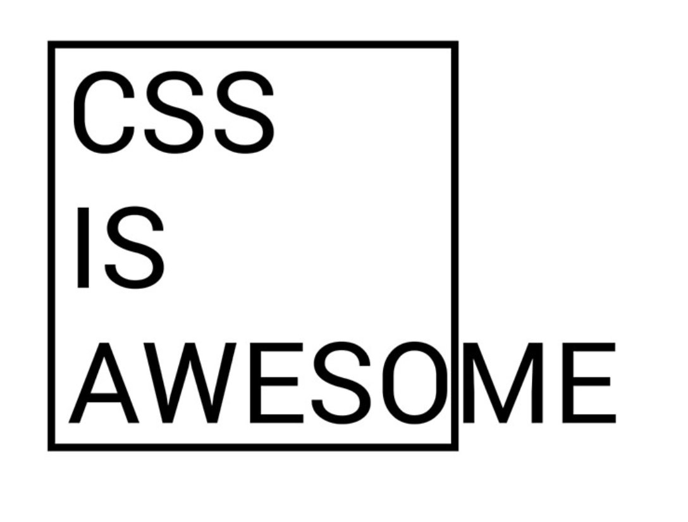

I'm quite new at frontend development, never done more than a couple
of personal tools, one of them in pure HTML generated by 
<abbr title="Java Server Pages">JSPs</abbr>  and other using Angular 5/6
that was published inside a Sharepoint site.

Despite this lack of experience, I'm familiar with the "CSS is awesome" meme:



Source: [CSS Tricks](https://css-tricks.com/css-is-in-fact-awesome/)

And it was a matter of time that I had the first CSS mistery in this blog.

I realised that while browsing this blog, when I entered the 
[Hello World](https://pimentel.page/blog/hello-world/) the position
of the title and the links was slightly different than the rest of the pages
(About and Blog). Using the developer tools I realised that, although the main
div had the 800px size I had defined, the total width of the page changed,
changing the center of the page in the process and moving the whole page
left or right.

It has taken me a couple of days of entering and exiting the page to realize that
the problem was originated by the scroll bar! If the page was long enough to need
a scroll bar, then the width of the scrollbar changed the width of the page. That 
also explained why in mobile it didn´t happen, because mobile browsers do not show
a scrollbar.

Knowing the problem, a quick Google search showed several solutions. The one I chose
was applying this css style to the `<html>` node:

```css
html {
    overflow-y: scroll;
}
```

This makes the browser take into account the size of the scrollbar even if it is not
needed in the page, so now all the pages have the content correctly centered. You can
see the whole commit [here](https://github.com/cpiment/pimentel.page/commit/5b872f24571540b85a18e3fa661435b06092c7fa).
