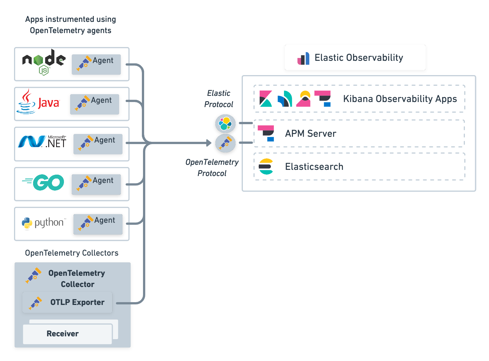

As you might have guessed seeing other posts, I'm kind of a heavy user of the Elastic Stack. My primary use case has always been get 
the most of the invisible data that was scattered around the datacenter. Before ELK, we did not have any way to analyze the logs of 
hundreds of Apache servers and get insights about the behaviour, and error tracing consisted on a set of scripts that downloaded the 
logs from different machines so we could `grep` them.

My first contact with the ELK Stack was when I discovered Logstash and used it to recover data from 
[Oracle APM](https://www.oracle.com/es/manageability/application-performance-monitoring/) (Now it seems is only a cloud solution) to a MongoDB 
database, where reports were created using [Pentaho Report Designer](https://help.hitachivantara.com/Documentation/Pentaho/8.2/Products/Report_Designer). 
It was weeks later when I learnt that Elastic stack could simplify all that!

So when I had the chance to test Elastic APM I realised that was a powerful tool that was tightly integrated with the rest of the data I was already 
collecting from different sources.

Now we are starting to use Azure Cloud to spin up some datacenter load there, and I thought that it would be great to have information about 
our infrastructure deployment process into Elastic, which includes some Python scripts which use the Azure Python SDK to create and configure
Virtual Machines. Searching if I could integrate Jenkins (which was our CI/CD tool at that time) with APM 
(which is [possible](https://www.elastic.co/guide/en/observability/current/ci-cd-observability.html)), I started to learn about OpenTelemetry.

OpenTelemetry is an open API that specifies how telemetry data has to be collected and correlated between servers. There are agent implementations 
for several languages, and the best part is that Elastic APM Server understands the OpenTelemetry protocol:



Source: [APM 7 OpenTelemetry Integration](https://www.elastic.co/guide/en/apm/guide/7.17/open-telemetry.html)

At least that was what the documentation said... I tried to start an APM server and configure the Python OTEL agent in a custom application, but I wasn't
able to receive the traces in the server. I almost surrender until I found this [issue](https://github.com/elastic/apm-server/issues/4503) where
it was stated that only OTLP/gRPC (OpenTelemetry Protocol over gRPC) was supported (in more updated versions of APM servers 
[both gRPC and HTTP protocols](https://www.elastic.co/guide/en/apm/guide/8.10/open-telemetry-direct.html#open-telemetry-proxy-apm) are supported)

I created a Python file named `otel_bootstrap.py` with a code similar to this:
```python
from opentelemetry import trace
from opentelemetry.sdk.trace import TracerProvider
from opentelemetry.sdk.resources import Resource, SERVICE_NAME, DEPLOYMENT_ENVIRONMENT
from opentelemetry.exporter.otlp.proto.grpc.trace_exporter import OTLPSpanExporter
from opentelemetry.sdk.trace.export import BatchSpanProcessor
from grpc import ssl_channel_credentials
import os

cert = None
# Custom TLS Certificate for APM Server
with open("./certs/apm.cer","rb") as file:
        cert = file.read()
        
ssl_channel_credentials = ssl_channel_credentials(root_certificates=cert)

# Exporter
exporter = OTLPSpanExporter(endpoint="https://apm-server-endpoint.domain",credentials=ssl_channel_credentials)

# Resource
resource = Resource.create(attributes={
    SERVICE_NAME: os.environ["SERVICE_NAME"] if 'SERVICE_NAME' in os.environ.keys() else "my-app",
    DEPLOYMENT_ENVIRONMENT: os.environ["DEPLOYMENT_ENVIRONMENT"]
})

# Bootstrap trace
trace.set_tracer_provider(TracerProvider(resource=resource))
tracer = trace.get_tracer(__name__)
trace.get_tracer_provider().add_span_processor(
    BatchSpanProcessor(exporter)
)
```

In my app I just had to add `import otel_bootstrap` in my application entrypoint to get traces into APM Server. Now that I had that working, 
I could just simple configure the OpenTelemetry tracing in Azure Python SDK:

```python
from azure.core.settings import settings
from azure.core.tracing.ext.opentelemetry_span import OpenTelemetrySpan
settings.tracing_implementation = OpenTelemetrySpan
```

And that's it! All the calls to the Azure Python SDK are automatically instrumented and send traces to the APM Server without having 
to instrument my application code.

## References

[APM 7 OpenTelemetry Integration](https://www.elastic.co/guide/en/apm/guide/7.17/open-telemetry.html)

[OpenTelemetry Instrumentation for Python](https://opentelemetry.io/docs/instrumentation/python/)

[Azure SDK for Python OpenTelemetry client](https://learn.microsoft.com/en-us/python/api/overview/azure/core-tracing-opentelemetry-readme?view=azure-python-preview)
