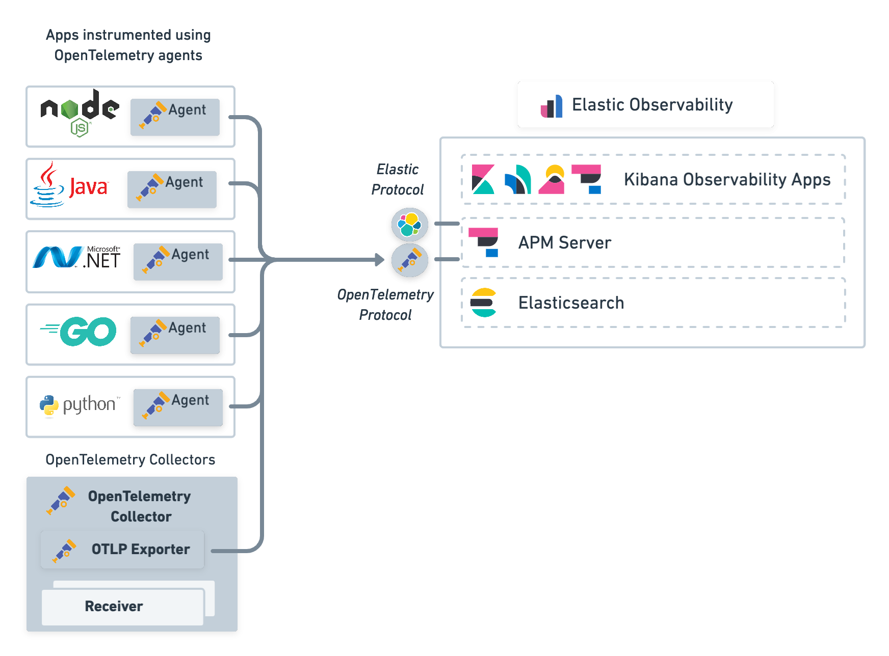

As you might have guessed seeing other posts, I'm kind of a heavy user of the Elastic Stack. My primary use case has always been get the most of the invisible data that was scattered around the datacenter. Before ELK, we did not have any way to analyze the logs of hundreds of Apache servers and get insights about the behaviour, and error tracing consisted on a set of scripts that downloaded the logs from different machines so we could `grep` them.

My first contact with the ELK Stack was when I discovered Logstash and used it to recover data from [Oracle APM](https://www.oracle.com/es/manageability/application-performance-monitoring/) (Now it seems is only a cloud solution) to a MongoDB database, where reports were created using [Pentaho Report Designer](https://help.hitachivantara.com/Documentation/Pentaho/8.2/Products/Report_Designer). It was weeks later when I learnt that Elastic stack could simplify all that!

So when I had the chance to test Elastic APM I realised that was a powerful tool that was tightly integrated with the rest of the data I was already collecting from different sources.

Now we are starting to use Azure Cloud to spin up some datacenter load there, and I thought that it would be great to have information about our infrastructure deployment process into Elastic. Searching if I could integrate Jenkins with APM (which is [possible](https://www.elastic.co/guide/en/observability/current/ci-cd-observability.html)), I started to learn about OpenTelemetry.

OpenTelemetry is an open API that specifies how telemetry data has to be collected and correlated between servers. There are agent implementations for several languages, and the best part is that Elastic APM Server understands the OpenTelemetry protocol:

Source: [APM 7 OpenTelemetry Integration](https://www.elastic.co/guide/en/apm/guide/7.17/open-telemetry.html)

At least that was what the documentation said...

## References

(1) [APM 7 OpenTelemetry Integration](https://www.elastic.co/guide/en/apm/guide/7.17/open-telemetry.html)
(2) [OpenTelemetry Instrumentation for Python](https://opentelemetry.io/docs/instrumentation/python/)
(3) [Azure SDK for Python OpenTelemetry client](https://docs.microsoft.com/en-us/python/api/overview/azure/core-tracing-opentelemetry-readme?view=azure-python-preview)
